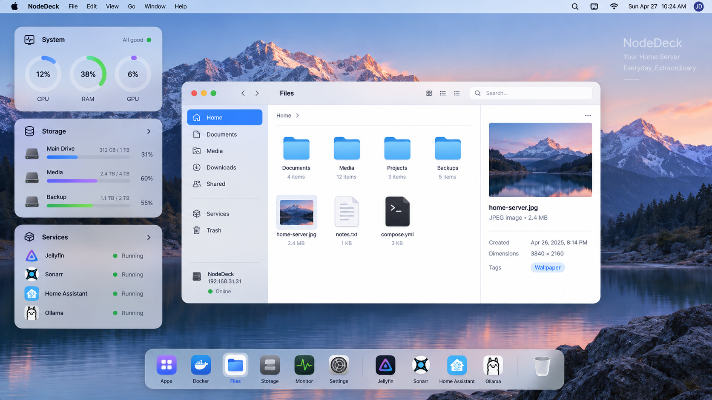

<div align="center">

# NodeDesk

**A desktop for your home server.** Your server, arranged like a Mac: wallpaper, widgets, a dock and windows, not another admin dashboard.

`One Go binary` · `SQLite` · `React` · `MIT`

</div>

<p align="center"></p>

> The image above is the **design reference** the UI is built against (`examples/design.png`).

## What you get

| | |
|---|---|
| **Desktop shell** | Wallpaper, menu bar, dock with magnification, draggable / resizable windows, light and dark mode, `Ctrl/⌘ K` launcher. |
| **Widgets** | *System* (CPU / RAM / GPU), *Storage* (mounts and usage), *Services* (your apps and their state). Arrange them freely; the layout is saved. Adding your own is a matter of dropping a folder in ([guide](docs/widgets.md)). |
| **Apps** | A first-class notion of “app”: a Docker container, a systemd service, an external URL or a manual entry, shown as an application. Discover running containers with one click. |
| **Files** | A Finder-style explorer: grid / list, preview pane, context menus, drag & drop, upload (files and folders), download (zip for folders), rename, copy, move, trash, search, properties, and a built-in editor (CodeMirror 6) with Markdown, JSON / YAML, code, image, audio, video and PDF preview. Only folders you authorise are reachable. |
| **Docker** | Containers (state, ports, mounts, CPU / RAM, live logs, start / stop / restart) and images, through the Docker Engine SDK. No CLI, no shell. |
| **Storage** | Disks, partitions, mounts, filesystems, temperatures, live I/O, optional SMART, and an on-demand, cached “what is using my space” analysis. |
| **Monitor** | A task-manager style view of CPU, memory, GPU (NVIDIA via NVML, AMD via sysfs), VRAM, network and disk I/O. |

## Quick start

Requirements: Go ≥ 1.25, Node ≥ 20, [pnpm](https://pnpm.io), a C compiler (only for NVIDIA GPU support; see below).

```bash
make build                      # frontend + backend -> ./bin/nodedesk (single binary)

NODEDESK_ADDR=0.0.0.0:8420 \
NODEDESK_ADMIN_PASSWORD='choose-a-password' \
./bin/nodedesk
```

Open <http://localhost:8420>. Without `NODEDESK_ADMIN_PASSWORD`, the first start prints a one-time **setup code** in the log; the login screen asks for it together with the password you want.

The binary contains the whole UI (`go:embed`). At runtime it needs nothing but itself and one SQLite file (`~/.local/share/nodedesk/nodedesk.db` by default).

## Documentation

- [Architecture](docs/architecture.md): how the pieces fit, and why.
- [Configuration](docs/configuration.md): environment variables and in-app settings.
- [Security](docs/security.md): threat model, sandboxing of files, what is deliberately *not* there.
- [Development](docs/development.md): dev setup, project layout, tests.
- [Widgets](docs/widgets.md): build your own widget.
- [Integrations](docs/integrations.md): add a desktop app or a new kind of service.
- [Contributing](CONTRIBUTING.md)

## Design principles

1. **Design is a feature.** It should feel like a desktop, so few elements, lots of whitespace, discreet motion.
2. **Light.** One Go process, one SQLite file. Sampling stops when nobody is watching; nothing is scanned in the background.
3. **Typed, never generic.** There is no `/exec`. Every operation is a narrow, validated endpoint.
4. **Extensible without a plugin system.** Widgets and desktop apps are self-contained folders discovered at build time.

## Stack

Go (`chi`, `modernc.org/sqlite`, `gopsutil`, Docker Engine SDK, `go-nvml`, `go-systemd`) · React 19, TypeScript, Vite, Tailwind CSS 4, shadcn/ui (Radix), TanStack Query, Zustand, CodeMirror 6.

## License

[MIT](LICENSE)
